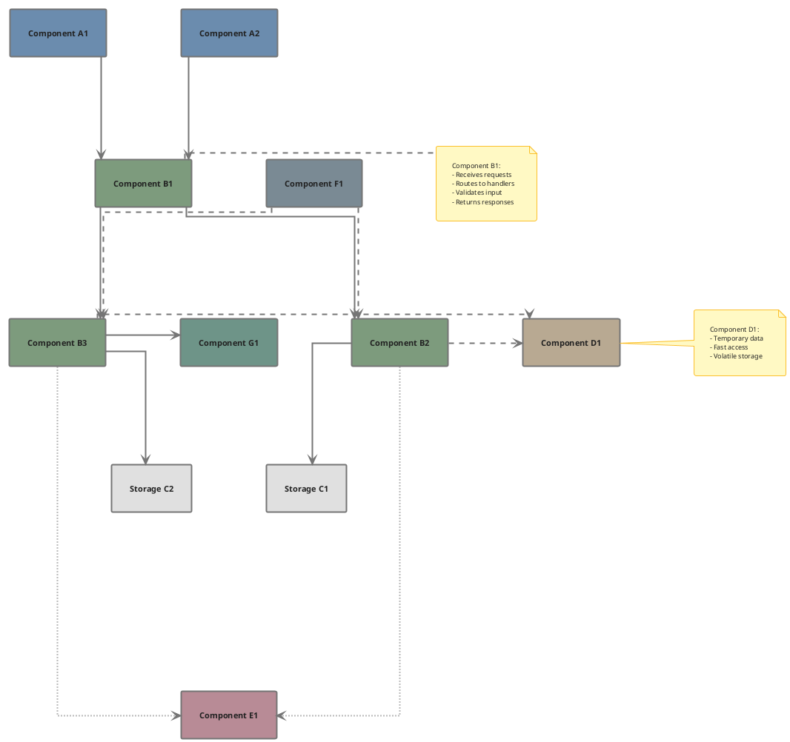
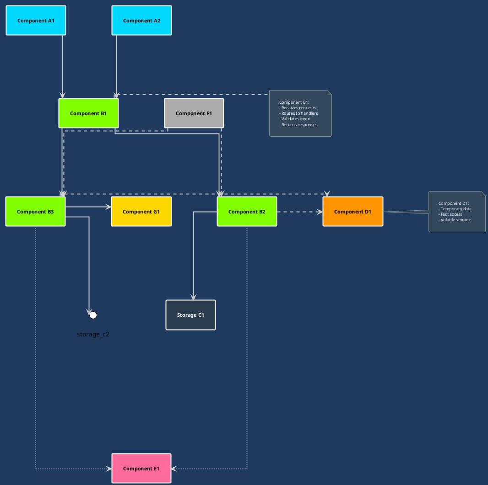
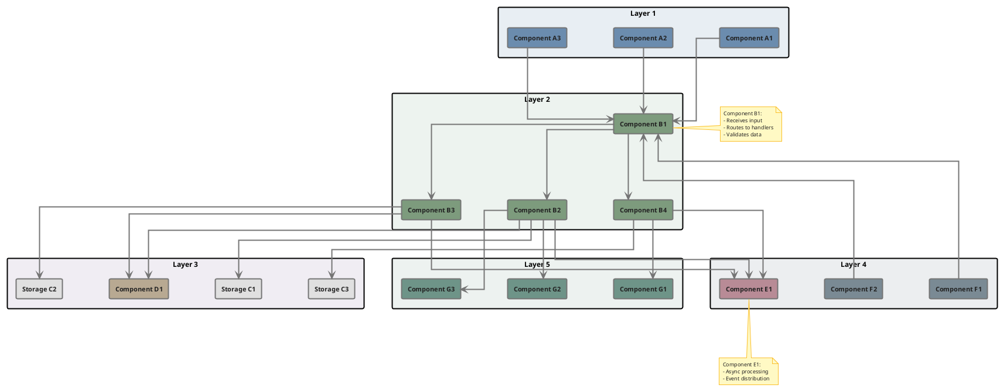

# PlantUML Engineering Style Specification

**Complete specification for creating beautiful, readable PlantUML diagrams**

## Table of Contents
1. [Color Scheme](#color-schemes)
2. [Complete Template](#complete-template)
3. [Component Colors](#component-colors)
4. [Grouping Examples](#grouping-examples)
5. [Configuration Settings](#configuration-settings)
6. [Rules and Best Practices](#rules-and-best-practices)

---

## Color Schemes

### 🎨 Universal Color Rule

**IMPORTANT:** Text color must contrast with background color:
- **Bright/Light backgrounds** → Use **Black text** (`#000000`)
- **Dark/Muted backgrounds** → Use **White text** (`#FFFFFF`)

Apply this rule to ALL components in ALL themes.

---

### Light Theme - Professional Engineering Palette

| Component Type | Color | Hex | Text Color | Usage |
|---------------|-------|-----|------------|-------|
| **Type A** | Steel Blue | `#6B8CAE` | White `#FFFFFF` | Client-facing components |
| **Type B** | Sage Green | `#7D9B7D` | White `#FFFFFF` | Processing components |
| **Type C** | Slate Purple | `#8B7B9B` | White `#FFFFFF` | Storage components |
| **Type D** | Warm Grey | `#B8A992` | White `#FFFFFF` | Temporary storage components |
| **Type E** | Dusty Rose | `#B88B96` | White `#FFFFFF` | Async communication components |
| **Type F** | Cool Grey | `#7A8A94` | White `#FFFFFF` | Supporting components |
| **Type G** | Teal Grey | `#6E9488` | White `#FFFFFF` | External/third-party components |

**Rule:** These muted colors are dark enough that white text provides better contrast and readability.

### Group Background Colors

| Group | Background | Border | Text Color |
|-------|-----------|--------|------------|
| **Layer 1** | `#E7EDF2` | `#6B8CAE` | White |
| **Layer 2** | `#EBF0EB` | `#7D9B7D` | White |
| **Layer 3** | `#EEEAF0` | `#8B7B9B` | White |
| **Layer 4** | `#EBEDEF` | `#7A8A94` | White |
| **Layer 5** | `#EBF0EE` | `#6E9488` | White |

### Dark Theme - Chalkboard Style (like in the image)

Dark background with bright accent colors:

| Component Type | Color | Hex | Text Color | Usage |
|---------------|-------|-----|------------|-------|
| **Type A** | Bright Cyan | `#00D9FF` | Black `#000000` | Client-facing components |
| **Type B** | Lime Green | `#7FFF00` | Black `#000000` | Processing components |
| **Type C** | Purple | `#9B59B6` | White `#FFFFFF` | Storage components |
| **Type D** | Orange | `#FF9500` | Black `#000000` | Temporary storage components |
| **Type E** | Pink | `#FF6B9D` | Black `#000000` | Async communication components |
| **Type F** | Light Grey | `#AAAAAA` | Black `#000000` | Supporting components |
| **Type G** | Yellow | `#FFD700` | Black `#000000` | External/third-party components |

**Background:** `#1E3A5F` (Dark Blue) or `#2C3E50` (Dark Slate)  
**Component Text:** Black for bright colors, White for dark colors  
**Arrows:** `#CCCCCC` (Light Grey)

### Arrow Styles

Different arrow styles for different types of connections:

| Arrow Type | Syntax | Usage |
|-----------|--------|-------|
| **Solid** | `-->` | Synchronous calls, direct dependencies |
| **Dashed** | `..>` | Async calls, optional dependencies |
| **Bold** | `==>` | Primary data flow |
| **Dotted** | `~~>` | Weak dependencies, notifications |

---

## Complete Template

### Basic Template (Copy & Use)



### Dark Theme Template (Chalkboard Style)



---

## Component Colors

### Light Theme Colors

#### Type A - Client-facing Components
```plantuml
component [Component A1] as comp_a1 #6B8CAE
component [Component A2] as comp_a2 #6B8CAE
component [Component A3] as comp_a3 #6B8CAE
component [Component A4] as comp_a4 #6B8CAE
```

#### Type B - Processing Components
```plantuml
component [Component B1] as comp_b1 #7D9B7D
component [Component B2] as comp_b2 #7D9B7D
component [Component B3] as comp_b3 #7D9B7D
component [Component B4] as comp_b4 #7D9B7D
component [Component B5] as comp_b5 #7D9B7D
```

#### Type C - Storage Components
```plantuml
database [Storage C1] as storage_c1
database [Storage C2] as storage_c2
database [Storage C3] as storage_c3
' Color defined in skinparam database
```

#### Type D - Temporary Storage Components
```plantuml
component [Component D1] as comp_d1 #B8A992
component [Component D2] as comp_d2 #B8A992
component [Component D3] as comp_d3 #B8A992
```

#### Type E - Async Communication Components
```plantuml
component [Component E1] as comp_e1 #B88B96
component [Component E2] as comp_e2 #B88B96
component [Component E3] as comp_e3 #B88B96
component [Component E4] as comp_e4 #B88B96
```

#### Type F - Supporting Components
```plantuml
component [Component F1] as comp_f1 #7A8A94
component [Component F2] as comp_f2 #7A8A94
component [Component F3] as comp_f3 #7A8A94
component [Component F4] as comp_f4 #7A8A94
```

#### Type G - External Components
```plantuml
component [Component G1] as comp_g1 #6E9488
component [Component G2] as comp_g2 #6E9488
component [Component G3] as comp_g3 #6E9488
component [Component G4] as comp_g4 #6E9488
```

### Dark Theme Colors (Chalkboard Style)

#### Type A - Client-facing Components
```plantuml
component [Component A1] as comp_a1 #00D9FF
component [Component A2] as comp_a2 #00D9FF
component [Component A3] as comp_a3 #00D9FF
```

#### Type B - Processing Components
```plantuml
component [Component B1] as comp_b1 #7FFF00
component [Component B2] as comp_b2 #7FFF00
component [Component B3] as comp_b3 #7FFF00
```

#### Type C - Storage Components
```plantuml
database [Storage C1] as storage_c1
database [Storage C2] as storage_c2
' Background: #9B59B6 (Purple)
```

#### Type D - Temporary Storage Components
```plantuml
component [Component D1] as comp_d1 #FF9500
component [Component D2] as comp_d2 #FF9500
```

#### Type E - Async Communication Components
```plantuml
component [Component E1] as comp_e1 #FF6B9D
component [Component E2] as comp_e2 #FF6B9D
```

#### Type F - Supporting Components
```plantuml
component [Component F1] as comp_f1 #AAAAAA
component [Component F2] as comp_f2 #AAAAAA
```

#### Type G - External Components
```plantuml
component [Component G1] as comp_g1 #FFD700
component [Component G2] as comp_g2 #FFD700
```

---

## Grouping Examples

### Example with Grouped Components



### Group Syntax

```plantuml
rectangle "Group Name" #BackgroundColor {
    component [Component 1] as c1 #Color
    component [Component 2] as c2 #Color
}
```

---

## Configuration Settings

### Small Diagrams (< 15 components)
```plantuml
skinparam nodesep 80
skinparam ranksep 100
skinparam padding 10
skinparam margin 20

skinparam component {
    FontSize 11
    BorderThickness 2
}

skinparam arrow {
    Thickness 2
}
```

### Medium Diagrams (15-30 components)
```plantuml
skinparam nodesep 70
skinparam ranksep 90
skinparam padding 9
skinparam margin 18

skinparam component {
    FontSize 10
    BorderThickness 2
}

skinparam arrow {
    Thickness 2
}
```

### Large Diagrams (> 30 components)
```plantuml
skinparam nodesep 60
skinparam ranksep 80
skinparam padding 8
skinparam margin 15

skinparam component {
    FontSize 9
    BorderThickness 1
}

skinparam arrow {
    Thickness 1
}
```

---

## Rules and Best Practices

### 1. Base Structure
```plantuml
@startuml
!theme plain
skinparam backgroundColor white
skinparam linetype ortho
skinparam componentStyle rectangle
```

### 2. Component Colors
- **Always specify color** after `as`: `component [Name] as alias #COLOR`
- **Databases** use color from `skinparam database`
- **Groups** use light shades of main colors

### 3. Arrows
- **NO LABELS**: `comp1 -down-> comp2`
- **With direction**: `-down->`, `-right->`, `-up->`, `-left->`
- **Arrow color**: grey `#757575` (neutral)

**Why no labels?** Labels on arrows overlap with other elements in complex diagrams.

### 4. Notes
- **For descriptions** instead of arrow labels
- **Color**: yellow `#FFF9C4` (like sticky notes)
- **Placement**: `note right of`, `note left of`, `note bottom of`

### 5. Grouping
- **Use** `rectangle` for logical groups
- **Background color** should be light
- **Name** should be brief and clear

### 6. Arrow Directions

| Syntax | Direction |
|--------|-----------|
| `comp1 -right-> comp2` | Right |
| `comp1 -left-> comp2` | Left |
| `comp1 -down-> comp2` | Down |
| `comp1 -up-> comp2` | Up |

### 7. Quality Checklist

Before publishing, verify:

- [ ] Uses `!theme plain`
- [ ] Set `skinparam linetype ortho`
- [ ] Configured `nodesep` and `ranksep`
- [ ] All components have colors
- [ ] Colors match component type
- [ ] Arrows WITHOUT labels
- [ ] Arrows WITH directions
- [ ] Descriptions in notes, not on arrows
- [ ] Groups have light backgrounds
- [ ] Tested in PlantUML Online Server

### 8. Quick Start

1. **Copy** the complete template
2. **Replace** components with yours
3. **Assign colors** by component type
4. **Add groups** if needed
5. **Test** at [PlantUML Online Server](http://www.plantuml.com/plantuml/uml/)

### 9. Tips

1. **Don't use more than 7 colors** in one diagram
2. **Group** similar components with same color
3. **Use light backgrounds** for groups
4. **Notes** for important descriptions
5. **Test** on different screens

---

## Summary

### Key Points

1. **Color Scheme**: Material Design palette (7 colors)
2. **No Arrow Labels**: Use notes for descriptions
3. **Directed Arrows**: `-down->`, `-right->`, `-up->`, `-left->`
4. **Grouping**: `rectangle` with light backgrounds
5. **Spacing**: Adjust `nodesep` and `ranksep` for diagram size

### Color Reference

- Type A (Client-facing): `#6B8CAE` (Muted Blue)
- Type B (Processing): `#7D9B7D` (Muted Green)
- Type C (Storage): `#9B87B3` (Muted Purple)
- Type D (Temporary storage): `#B8A992` (Muted Orange)
- Type E (Async communication): `#B88B96` (Muted Pink)
- Type F (Supporting): `#7A8A94` (Steel Grey)
- Type G (External): `#6E9488` (Muted Teal)

### Quick Template

```plantuml
@startuml
!theme plain
skinparam backgroundColor white
skinparam linetype ortho
skinparam nodesep 80
skinparam ranksep 100

component [Component A] as comp_a #6B8CAE
component [Component B] as comp_b #7D9B7D
database [Storage C] as storage_c

comp_a -down-> comp_b
comp_b -down-> storage_c
@enduml
```

---

**That's it! Copy, modify, and create beautiful diagrams!** 🎉

